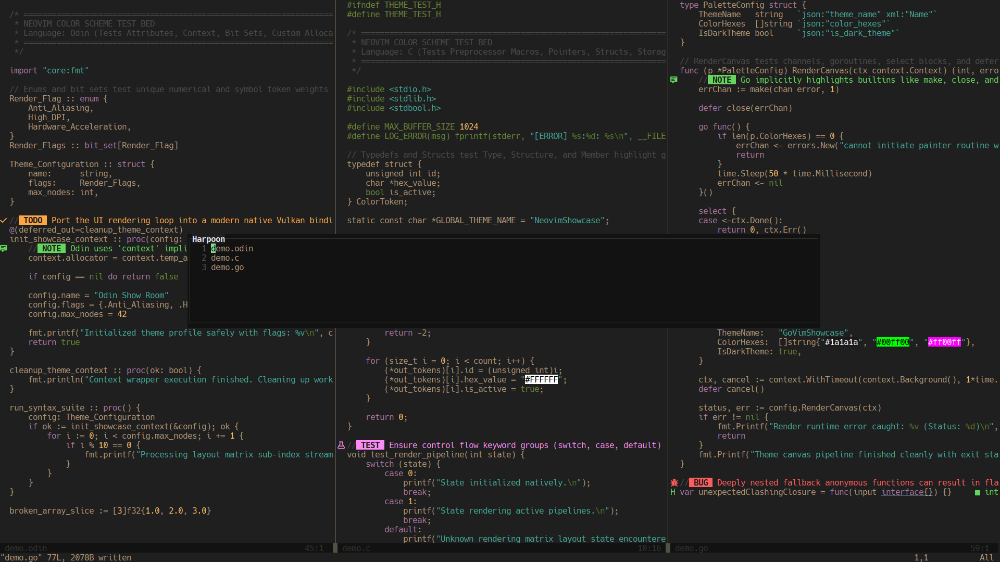

## darksand.nvim

Just a dark color scheme with sandy colors.



#### Lualine


### Installation

Just add this to your lazy setup.

```lua
"nrawc/darksand.nvim"
```

Then add this to your init.lua to enable the colorscheme.

```lua
vim.cmd.colorscheme('darksand')
```
